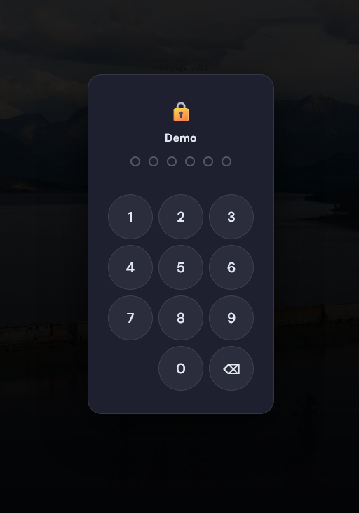

# Changelog

## v1.1.0

### New features

**Rich layout options**

The service configuration panel now includes a full set of layout controls: adjust icon size, choose between list and grid layouts, set the number of columns per category, and reorder everything inline with drag handles.

---

**PIN-protected pages**

Lock any page behind a numeric PIN. When a PIN is set, a lock icon appears next to the page tab. Visitors see a PIN pad overlay before accessing the page content.

---

**Custom CSS per page**

Each page now has a dedicated CSS field. Write any valid CSS and it is applied instantly - override fonts, colors, spacing, or completely retheme the dashboard to match your style.

---

### Improvements

- **Text color control** - Choose a custom text color per page to match your wallpaper or CSS theme
- **Config panel polish** - Smoother transitions, better button placement, and clearer section separators

---

## v1.0.0

Initial public release.
