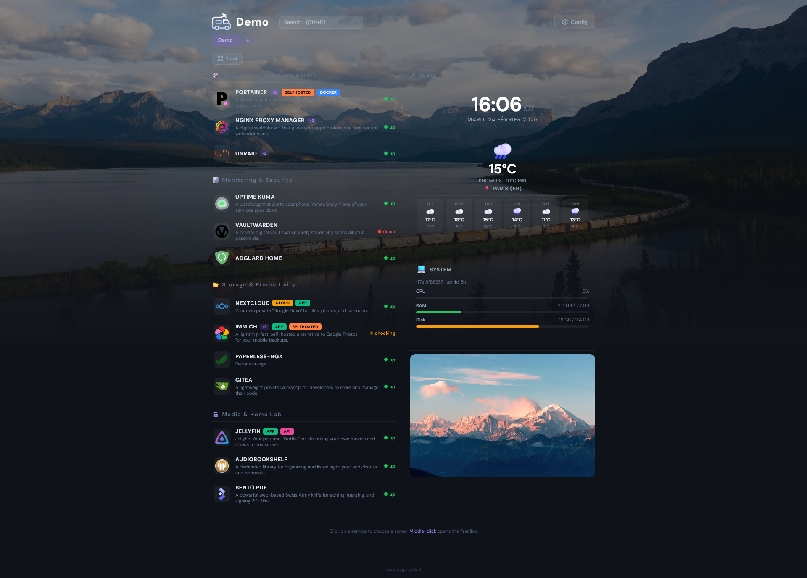
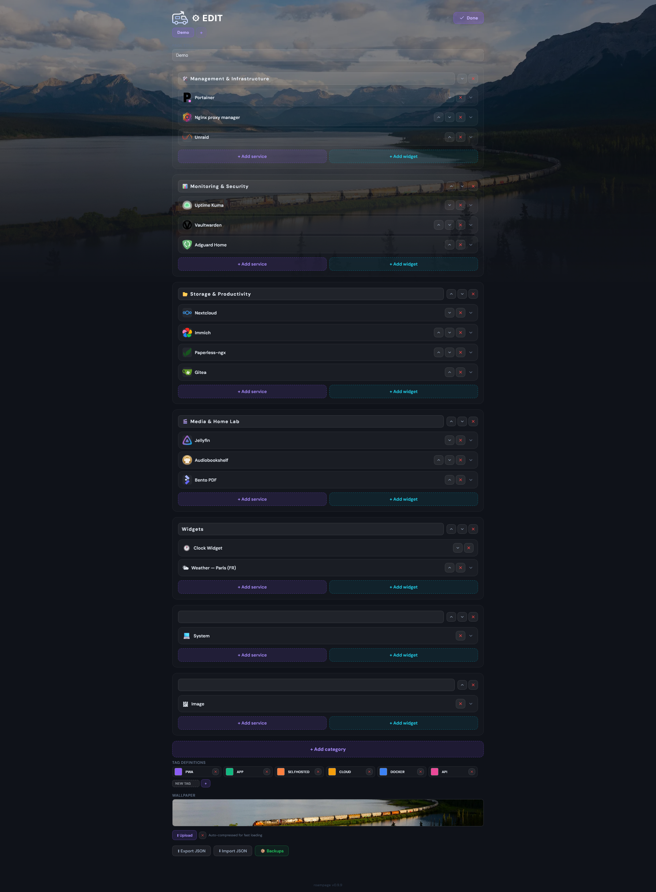
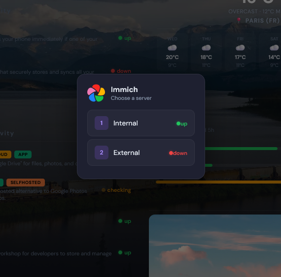
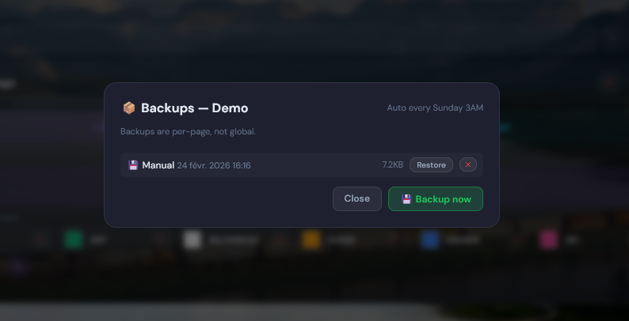

#  Roampage
A self-hosted, responsive dashboard for your services. Fully configurable from the browser — no code editing needed.

**[→ Try the live demo](https://anagraphy.github.io/roampage/)**

## Features

### Dashboard
- **Responsive** — Works on desktop and mobile
- **Inline editing** — Click "Config" to add, edit and reorder categories, services and servers directly from the browser
- **Multi-server support** — Click a service with multiple servers to pick which one to open
- **Multi-page** — Create multiple pages, each with their own categories, services, tags and wallpaper
- **Live health checks** — Real-time up/down status for each service and server, with per-server indicators in the selector
- **Search** — Filter services instantly by name or description (`Ctrl+K`)
- **Custom tags** — Create, rename, recolor and delete tags with a built-in color picker
- **Wallpaper** — Upload a background image per page with automatic compression and smooth gradient fade
- **Icon browser** — Browse and search 2500+ icons from dashboardicons.com directly in the editor
- **Auto URL prefix** — IP addresses automatically get `http://`, domains get `https://`
- **Encrypted config** — Configuration and backups are encrypted at rest with AES-256-GCM
- **Import/Export** — Export and import your full config as JSON, with embedded images
- **No build step** — Pure HTML/CSS/JS frontend, Node.js backend

- **Widgets** — Clock, Weather, Bookmarks, Text, Image, Iframe, Countdown, Separator, System monitor

## Screenshots

<br>
*Main dashboard — organize your self-hosted services by category, with live health checks and custom tags.*

<br>
*Inline configuration — add, edit and reorder services directly from the browser, no config file editing needed.*

<br>
*Multi-server support — click any service to choose which server to open.*

<br>
*Backup manager — manual backups on demand and automatic weekly backups, restorable with a single click.*

## Installation

> **Note:** This project was built with AI assistance (vibe-coded). It works well for personal homelab use, but review the code with your own judgment before deploying in sensitive environments.

### Prerequisites
- [Docker](https://docs.docker.com/get-docker/) and [Docker Compose](https://docs.docker.com/compose/install/) installed on your machine.

### Step by step

**1. Create a folder for Roampage and navigate into it:**
```bash
mkdir roampage && cd roampage
```

**2. Create the `docker-compose.yml` file:**
```bash
nano docker-compose.yml
```

Paste the following content, then save with `Ctrl+O`, `Enter`, and exit with `Ctrl+X`:
```yaml
services:
  roampage:
    image: anagraphy/roampage:latest
    container_name: roampage
    ports:
      - "3046:3000"
    volumes:
      - roampage_data:/data
    restart: unless-stopped

volumes:
  roampage_data:
```

**3. Start the container:**
```bash
docker compose up -d
```

**4. Open your browser and go to:**
```
http://localhost:3046
```

Click **Config** in the top-right corner to start adding your services.

---

### Build from source

If you prefer to build the image yourself instead of pulling it:

```bash
git clone https://github.com/Anagraphy/roampage.git
cd roampage
docker compose up -d --build
```

## Configuration

All configuration is done through the web UI. Click the **Config** button in the top-right corner.

You can also manually edit the config file at the mounted volume path `/data/config.json` inside the container.

### Environment Variables
| Variable | Default | Description |
|---|---|---|
| `PORT` | `3000` | Internal port the server listens on |
| `CONFIG_PATH` | `/data/config.json` | Path to the config file |
| `ENCRYPTION_KEY` | *(auto)* | AES-256-GCM key for config & backups — see below |

### Encryption

Config and backups are encrypted at rest with AES-256-GCM. Three modes are available:

| `ENCRYPTION_KEY` value | Behaviour |
|---|---|
| *(not set)* | A random key is generated on first run and saved to `./data/.roampage.key`. Survives container restarts as long as the volume is intact, but backups become unrestorable if the key file is lost. |
| `"64-hex-chars"` | Fixed key, stays valid across rebuilds and volume migrations. **Recommended for reliability.** Generate once with `openssl rand -hex 32`. |
| `"none"` | Encryption disabled — config and backups stored as plain JSON. Backups are always restorable; no key to manage. |

> **Migration note:** switching from encrypted to `none` (or vice-versa) requires exporting your config from the UI first, then deleting `data/config.json` and any old backups before restarting with the new mode.

### Custom port
```yaml
ports:
  - "8080:3000"
```

### Bind mount instead of named volume
```yaml
volumes:
  - ./data:/data
```

> **Warning:** With a bind mount, make sure the `volumes:` section is always present in your `docker-compose.yml`. If it is missing, data is written inside the container and will be lost on the next `docker compose down`.

## Updating

```bash
docker compose pull && docker compose up -d
```

Your data is never affected by updates as long as the volume is correctly mounted.

## Data
- **Config** is stored at `/data/config.json`
- **Backups** are stored at `/data/backups/`
- **Wallpapers** are stored at `/data/wallpapers/`

All data is persisted via the Docker volume and is never touched by image updates.

## Security

### Security model

Roampage is designed for **trusted local networks** (home LAN, self-hosted VPN). Its security model assumes that anyone who can reach the server is allowed to use it — there is no built-in login.

### No authentication

Anyone who can reach Roampage can read and write your full configuration.

**If you expose Roampage outside your local network** (public internet, shared VPN, etc.), add authentication at the reverse-proxy layer before doing so. Tools like [Authelia](https://www.authelia.com/), [Authentik](https://goauthentik.io/), or nginx basic auth work well for this.

### What is protected

| Protection | Details |
|---|---|
| Config & backups at rest | AES-256-GCM encryption (see [Encryption](#encryption)) |
| Security headers | CSP, HSTS (HTTPS only), `X-Content-Type-Options`, `Referrer-Policy` |
| Rate limiting | All API endpoints are rate-limited per IP |
| SSRF | Loopback and cloud metadata IPs are blocked; DNS rebinding mitigated |
| File uploads | Extension + magic-byte validation, 10 MB size limit |

## Stack
- **Frontend**: Vanilla HTML/CSS/JS (no framework, no build)
- **Backend**: Node.js + Express
- **Icons**: [homarr-labs/dashboard-icons](https://github.com/homarr-labs/dashboard-icons)
- **Storage**: JSON file + image files on disk
